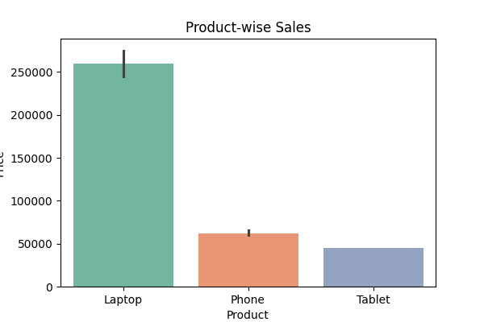

# Mini Project: Sales Analysis

---

## 1️⃣ Dataset Load

```python
import pandas as pd

data = {
    "OrderID":[1,2,3,4,5,6,7,8,9,10],
    "Product":["Laptop","Phone","Laptop","Tablet","Phone","Laptop","Tablet","Phone","Laptop","Tablet"],
    "Category":["Electronics","Electronics","Electronics","Electronics","Electronics","Electronics","Electronics",None,"Electronics","Electronics"],
    "Quantity":[1,2,1,3,2,1,3,2,None,1],
    "Price":[60000,20000,65000,15000,22000,70000,15000,20000,65000,15000],
    "Region":["North","South","East","West","North","South","East","West","North","East"]
}

df = pd.DataFrame(data)
print(df.head())
2️⃣ Data Cleaning
python
Copy code
df["Quantity"] = df["Quantity"].fillna(0)
df["Category"] = df["Category"].fillna("Electronics")
df["Product"] = df["Product"].str.strip()
df["Region"] = df["Region"].str.strip()

print(df)
✅ Notes:

Missing Quantity ko 0 se fill kiya.

Missing Category ko "Electronics" se fill kiya.

Extra spaces remove kiye (str.strip()).

3️⃣ Basic EDA (Exploratory Data Analysis)
python
Copy code
df["revenue"] = df["Quantity"]*df["Price"]

total_revenue = df["revenue"].sum()
print("Total Revenue:", total_revenue)

top_product = df.groupby("Product")["revenue"].sum().sort_values(ascending=False).head(1)
print("Top Sales Product:", top_product)

top_region = df.groupby("Region")["revenue"].sum().sort_values(ascending=False).head(1)
print("Region-wise Sales:", top_region)
4️⃣ Visualization
4.1 Product-wise Sales
Ye chart hume batata hai ki kaunse product ki sales sabse zyada hai:



4.2 Region-wise Sales
Ye chart region-wise sales dikhata hai:


4.3 Correlation Heatmap
Numeric columns ke beech correlation ka heatmap:


4.4 Product vs Revenue
Product ke hisab se revenue comparison:


4.5 Region-wise Sales Percentages (Pie Chart)
Region-wise revenue ka percentage distribution:


✅ Summary / Key Takeaways
Top product based on quantity and revenue identified.

North region is top in sales.

Visualizations help in better understanding of sales distribution.

Revenue column is essential for deeper insights.