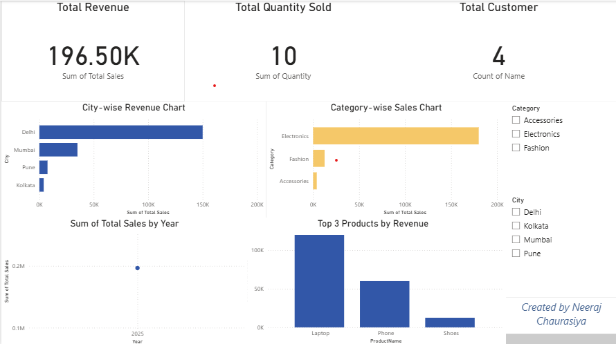

# 📅 Day 35 – Power BI Project Export & Portfolio Upload

## 🎯 Objective
Finalize and publish your **E-Commerce Sales Dashboard (Power BI + SQL)** project.  
Export files, organize folders, and prepare for **GitHub + LinkedIn portfolio showcase**.

---

## 🧩 Steps Completed

### 🔹 1. Final Dashboard Review
- Verified visuals, slicers, and KPIs.
- Ensured proper naming and titles (e.g., *Total Revenue*, *Top 5 Products*, *City-wise Sales*).
- Checked relationships and data consistency.

### 🔹 2. Export Files
**File → Export →**
- `ECommerce_Dashboard_Final.pbix` → Main Power BI project
- `ECommerce_Dashboard_Report.pdf` → Exported summary report
- `final_dashboard.png` → Dashboard screenshot for GitHub & LinkedIn

### 🔹 3. Folder Structure
```
Month_02/
 ├── Day_35_PowerBI_Publish/
 │   ├── ECommerce_Dashboard_Final.pbix
 │   ├── ECommerce_Dashboard_Report.pdf
 │   ├── screenshots/
 │   │   └── final_dashboard.png
 │   ├── README.md
 │   └── notes_35.md
```

---

## 🧾 README.md (Professional Summary)

### 📊 E-Commerce Sales Dashboard (Power BI + SQL)

#### 🎯 Objective
An interactive Power BI dashboard built using SQL data from the **ECommerceDB** database.  
This project visualizes **revenue trends, category performance, and customer insights** using DAX and Power Query.

#### 🧩 Key Insights
- 💰 Total Revenue: ₹196.5K  
- 🏙️ Top City: Delhi  
- 🛒 Top Category: Electronics  
- 📈 Sales Trend: Steady growth across months

#### ⚙️ Tech Stack
- Microsoft SQL Server (data source)  
- Power BI Desktop (data visualization)  
- Power Query (data cleaning)  
- DAX (KPI metrics & calculated columns)

#### 📂 Folder Overview
```
Day_35_PowerBI_Publish/
 ├── ECommerce_Dashboard_Final.pbix
 ├── ECommerce_Dashboard_Report.pdf
 ├── screenshots/
 │   └── final_dashboard.png
 ├── README.md
 └── notes_35.md
```

#### 📸 Dashboard Preview


#### 🌟 Portfolio Value
- ✅ Demonstrates **SQL + Power BI Integration**
- ✅ Real-world data modeling and dashboard design
- ✅ Client-ready presentation & export formats
- ✅ Adds professional touch to GitHub & LinkedIn portfolio

#### 🔗 Connect
📧 neerajchaurasiya593gmail.com 
💼 [LinkedIn Profile](https://linkedin.com/in/neeraj-chaurasiya)

---